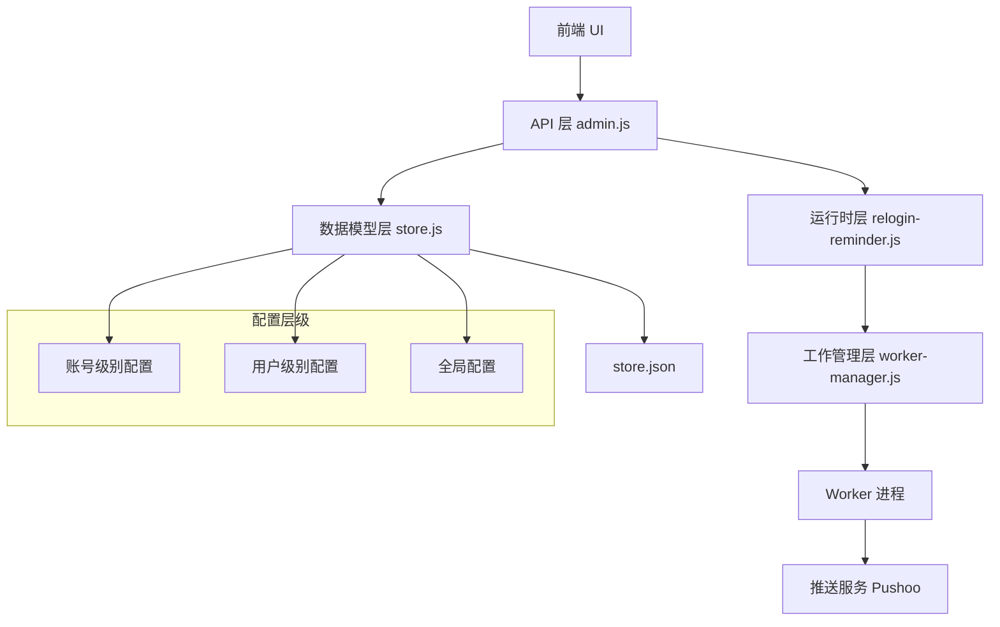
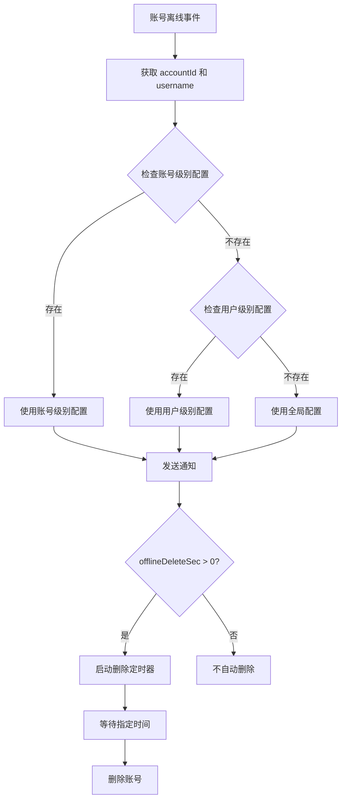

# 设计文档：账号下线提醒功能

## 概述

本设计文档描述了一个三层级的账号下线提醒系统，支持全局配置、用户级别配置和账号级别配置。该系统允许在不同粒度上管理账号离线通知，并支持多种推送渠道、自动删除和重登录链接功能。

配置优先级：账号级别 > 用户级别 > 全局配置

## 架构设计

### 系统架构图



### 层级说明

1. **前端 UI 层**：提供用户界面，包括全局设置和账号级别设置
2. **API 层**：处理 HTTP 请求，实现 RESTful API
3. **数据模型层**：管理配置数据的存储和检索
4. **运行时层**：处理下线提醒逻辑和重登录监听
5. **工作管理层**：管理 Worker 进程，监控账号状态
6. **Worker 进程**：独立进程，负责单个账号的运行
7. **推送服务**：通过 Pushoo 库发送通知到各种渠道

### 配置优先级系统

系统采用三层级配置优先级：

```
账号级别配置 (最高优先级)
    ↓ (如果不存在)
用户级别配置 (中等优先级)
    ↓ (如果不存在)
全局配置 (最低优先级，默认值)
```

查找逻辑：
1. 首先检查账号级别配置 (`accountConfigs[accountId].offlineReminder`)
2. 如果不存在，检查用户级别配置 (`userOfflineReminders[username]`)
3. 如果仍不存在，使用全局配置 (`offlineReminder`)

## 组件和接口

### 数据模型层 (store.js)

#### 数据结构

```javascript
// DEFAULT_ACCOUNT_CONFIG 扩展
const DEFAULT_ACCOUNT_CONFIG = {
    // ... 现有字段
    offlineReminder: null  // 新增：账号级别配置，null 表示使用上级配置
};

// globalConfig 结构
const globalConfig = {
    accountConfigs: {
        "[accountId]": {
            offlineReminder: {
                channel: string,
                endpoint: string,
                token: string,
                title: string,
                msg: string,
                offlineDeleteSec: number,
                reloginUrlMode: string
            } | null
        }
    },
    userOfflineReminders: {
        "[username]": {
            channel: string,
            endpoint: string,
            token: string,
            title: string,
            msg: string,
            offlineDeleteSec: number,
            reloginUrlMode: string
        }
    },
    offlineReminder: {
        channel: string,
        endpoint: string,
        token: string,
        title: string,
        msg: string,
        offlineDeleteSec: number,
        reloginUrlMode: string
    }
};
```

#### 新增函数

```javascript
/**
 * 获取账号级别的下线提醒配置
 * @param {string} accountId - 账号 ID
 * @returns {object|null} 配置对象或 null
 */
function getAccountOfflineReminder(accountId)

/**
 * 设置账号级别的下线提醒配置
 * @param {string} accountId - 账号 ID
 * @param {object|null} cfg - 配置对象，null 表示删除配置
 * @returns {object|null} 保存后的配置
 */
function setAccountOfflineReminder(accountId, cfg)

/**
 * 获取有效的下线提醒配置（按优先级查找）
 * @param {string} accountId - 账号 ID
 * @param {string} username - 用户名
 * @returns {object} 有效的配置对象
 */
function getEffectiveOfflineReminder(accountId, username)
```

#### 修改函数

```javascript
// cloneAccountConfig - 添加 offlineReminder 字段处理
// normalizeAccountConfig - 添加 offlineReminder 字段规范化
```

### 运行时层 (relogin-reminder.js)

#### 修改函数

```javascript
/**
 * 获取离线自动删除时间（毫秒）
 * @param {string} accountId - 账号 ID
 * @param {string} username - 用户名
 * @returns {number} 毫秒数，Infinity 表示不删除
 */
function getOfflineAutoDeleteMs(accountId, username)

/**
 * 触发下线提醒
 * @param {object} payload - 包含 accountId, accountName, username, reason 等信息
 */
async function triggerOfflineReminder(payload)
```

### 工作管理层 (worker-manager.js)

#### 修改点

在 `handleWorkerMessage` 函数中，当检测到账号离线时：
- 调用 `getOfflineAutoDeleteMs(accountId, worker.username)` 获取删除时间
- 调用 `triggerOfflineReminder({ accountId, accountName, username, reason, offlineMs })` 发送通知

### API 层 (admin.js)

#### 新增 API 端点

```javascript
// 1. 获取账号级别配置
GET /api/settings/account-offline-reminder
Headers: x-account-id: <accountId>
Response: {
    ok: true,
    data: {
        channel: string,
        endpoint: string,
        token: string,
        title: string,
        msg: string,
        offlineDeleteSec: number,
        reloginUrlMode: string
    } | null
}

// 2. 保存账号级别配置
POST /api/settings/account-offline-reminder
Headers: x-account-id: <accountId>
Body: {
    channel: string,
    endpoint: string,
    token: string,
    title: string,
    msg: string,
    offlineDeleteSec: number,
    reloginUrlMode: string
} | null
Response: {
    ok: true,
    data: <saved config>
}

// 3. 测试推送
POST /api/settings/account-offline-reminder/test
Headers: x-account-id: <accountId>
Body: {
    channel: string,
    endpoint: string,
    token: string,
    title: string,
    msg: string,
    reloginUrlMode: string
}
Response: {
    ok: true,
    data: { success: boolean, message: string }
}

// 4. 修改现有 GET /api/settings 端点
// 添加 useGlobalOfflineReminder 标识
Response: {
    ok: true,
    data: {
        // ... 现有字段
        offlineReminder: object,
        useGlobalOfflineReminder: boolean  // 新增
    }
}
```

## 数据模型

### 配置对象结构

```typescript
interface OfflineReminderConfig {
    channel: 'webhook' | 'dingtalk' | 'wecom' | 'bark' | 'telegram' | ...,
    endpoint: string,           // Webhook URL 或其他接口地址
    token: string,              // 认证令牌
    title: string,              // 通知标题
    msg: string,                // 通知内容
    offlineDeleteSec: number,   // 离线自动删除时间（秒），0 表示不删除
    reloginUrlMode: 'none' | 'qq_link' | 'qr_link'  // 重登录链接模式
}
```

### 存储结构

```json
{
    "offlineReminder": {
        "channel": "webhook",
        "endpoint": "https://example.com/webhook",
        "token": "xxx",
        "title": "账号下线提醒",
        "msg": "账号下线",
        "offlineDeleteSec": 3600,
        "reloginUrlMode": "none"
    },
    "userOfflineReminders": {
        "admin": {
            "channel": "dingtalk",
            "endpoint": "https://oapi.dingtalk.com/robot/send",
            "token": "yyy",
            "title": "管理员账号下线",
            "msg": "管理员账号已下线",
            "offlineDeleteSec": 1800,
            "reloginUrlMode": "qq_link"
        }
    },
    "accountConfigs": {
        "account123": {
            "offlineReminder": {
                "channel": "wecom",
                "endpoint": "https://qyapi.weixin.qq.com/cgi-bin/webhook/send",
                "token": "zzz",
                "title": "重要账号下线",
                "msg": "重要账号已下线，请立即处理",
                "offlineDeleteSec": 600,
                "reloginUrlMode": "qr_link"
            }
        },
        "account456": {
            "offlineReminder": null  // 使用用户级别或全局配置
        }
    }
}
```


## 运行时行为

### 配置查找流程



### 通知发送流程

1. **触发条件**：
   - Worker 进程检测到 WebSocket 断开连接
   - 连接状态变为 `connected: false`

2. **配置查找**：
   - 从 Worker 状态获取 `accountId` 和 `username`
   - 调用 `getEffectiveOfflineReminder(accountId, username)`
   - 按优先级返回有效配置

3. **通知构建**：
   - 使用配置中的 `title` 和 `msg`
   - 如果 `reloginUrlMode` 不为 `none`，生成重登录链接
   - 启动重登录监听器（如果需要）

4. **通知发送**：
   - 调用 Pushoo 库的 `sendPushooMessage` 函数
   - 传入 `channel`, `endpoint`, `token`, `title`, `content`
   - 记录发送结果

### 自动删除流程

1. **计时开始**：
   - 账号首次离线时，记录 `disconnectedSince` 时间戳
   - 设置 `autoDeleteTriggered = false`

2. **持续监控**：
   - 每次状态同步时检查离线时长
   - 计算 `offlineMs = now - disconnectedSince`

3. **触发删除**：
   - 当 `offlineMs >= autoDeleteMs` 且 `!autoDeleteTriggered`
   - 设置 `autoDeleteTriggered = true`
   - 发送下线提醒通知
   - 停止 Worker 进程
   - 从存储中删除账号信息

4. **重连恢复**：
   - 如果账号重新连接，重置 `disconnectedSince = 0`
   - 重置 `autoDeleteTriggered = false`

### 重登录链接模式

#### none
不生成重登录链接，通知中只包含基本信息。

#### qq_link
生成 QQ 小程序登录链接：
- 调用 `miniProgramLoginSession.requestLoginCode()`
- 获取 `loginUrl`（QQ 协议链接）
- 附加到通知内容：`\n\n重登录链接: ${qqUrl}`
- 启动重登录监听器

#### qr_link
生成二维码图片链接：
- 调用 `miniProgramLoginSession.requestLoginCode()`
- 获取 `qrcode`（二维码图片 URL）
- 附加到通知内容：`\n\n重登录二维码链接: ${qrcodeUrl}`
- 启动重登录监听器

## 前端组件设计

### 状态管理 (setting.ts)

```typescript
interface SettingStore {
    // 现有字段...
    
    // 新增字段
    accountOfflineReminder: OfflineReminderConfig | null;
    useGlobalOfflineReminder: boolean;
    
    // 新增方法
    fetchAccountOfflineReminder(accountId: string): Promise<void>;
    saveAccountOfflineReminder(accountId: string, config: OfflineReminderConfig | null): Promise<void>;
    testAccountOfflineReminder(accountId: string, config: OfflineReminderConfig): Promise<{ success: boolean, message: string }>;
}
```

### OfflineReminderConfig 组件

可复用的配置组件，用于显示和编辑下线提醒配置。

#### Props

```typescript
interface Props {
    accountId: string;                          // 账号 ID
    useGlobal: boolean;                         // 是否使用全局配置
    globalConfig: OfflineReminderConfig;        // 全局配置（只读）
    accountConfig: OfflineReminderConfig | null; // 账号级别配置
}
```

#### Events

```typescript
interface Events {
    'update:useGlobal': (value: boolean) => void;
    'update:accountConfig': (config: OfflineReminderConfig) => void;
    'saved': () => void;
}
```

#### 组件结构

```vue
<template>
    <div class="offline-reminder-config">
        <!-- 使用全局配置开关 -->
        <div class="switch-section">
            <label>
                <input type="checkbox" v-model="localUseGlobal" />
                使用全局配置
            </label>
        </div>
        
        <!-- 全局配置预览（只读） -->
        <div v-if="localUseGlobal" class="global-config-preview">
            <h4>当前全局配置</h4>
            <ConfigDisplay :config="globalConfig" readonly />
        </div>
        
        <!-- 账号级别配置表单 -->
        <div v-else class="account-config-form">
            <h4>账号专属配置</h4>
            <ConfigForm v-model="localAccountConfig" />
            
            <div class="actions">
                <button @click="testPush">测试推送</button>
                <button @click="saveConfig">保存账号级配置</button>
            </div>
        </div>
    </div>
</template>
```

### Settings 页面集成

在账号设置页面中集成 `OfflineReminderConfig` 组件：

```vue
<template>
    <div class="settings-page">
        <!-- 现有设置项... -->
        
        <!-- 下线提醒设置 -->
        <section class="offline-reminder-section">
            <h3>下线提醒设置</h3>
            <OfflineReminderConfig
                :account-id="currentAccountId"
                :use-global="useGlobalOfflineReminder"
                :global-config="globalOfflineReminder"
                :account-config="accountOfflineReminder"
                @update:use-global="handleUseGlobalChange"
                @update:account-config="handleAccountConfigChange"
                @saved="handleConfigSaved"
            />
        </section>
    </div>
</template>
```

## 错误处理

### 配置验证

1. **必填字段检查**：
   - `channel` 必须是支持的渠道之一
   - `token` 不能为空
   - `title` 和 `msg` 不能为空
   - Webhook 渠道必须提供 `endpoint`

2. **数值范围检查**：
   - `offlineDeleteSec` 必须 >= 0
   - 建议最小值为 300 秒（5 分钟）

3. **渠道特定验证**：
   - Webhook: 验证 URL 格式
   - 钉钉/企业微信: 验证 token 格式

### 运行时错误

1. **配置缺失**：
   - 如果所有层级都没有配置，记录错误日志
   - 不发送通知，但仍执行自动删除逻辑（如果有）

2. **推送失败**：
   - 记录详细错误信息
   - 不影响自动删除流程
   - 返回失败状态给前端

3. **网络错误**：
   - 推送服务不可达时，记录错误
   - 不重试（避免阻塞）
   - 建议用户检查网络和配置

### API 错误响应

```javascript
// 400 Bad Request - 参数错误
{
    ok: false,
    error: "Missing required field: token"
}

// 403 Forbidden - 权限不足
{
    ok: false,
    error: "无权访问此账号"
}

// 500 Internal Server Error - 服务器错误
{
    ok: false,
    error: "Failed to save configuration"
}
```

## 测试策略

### 单元测试

1. **数据模型层测试**：
   - 测试 `getAccountOfflineReminder` 返回正确配置
   - 测试 `setAccountOfflineReminder` 正确保存配置
   - 测试 `getEffectiveOfflineReminder` 优先级逻辑
   - 测试配置规范化函数

2. **运行时层测试**：
   - 测试 `getOfflineAutoDeleteMs` 计算正确
   - 测试 `triggerOfflineReminder` 发送通知
   - 测试重登录链接生成

3. **API 层测试**：
   - 测试 GET /api/settings/account-offline-reminder
   - 测试 POST /api/settings/account-offline-reminder
   - 测试 POST /api/settings/account-offline-reminder/test
   - 测试权限检查

### 集成测试

1. **配置优先级测试**：
   - 设置账号级别配置，验证使用账号配置
   - 删除账号级别配置，验证回退到用户配置
   - 删除用户配置，验证回退到全局配置

2. **通知发送测试**：
   - 模拟账号离线，验证通知发送
   - 验证不同渠道的通知格式
   - 验证重登录链接生成

3. **自动删除测试**：
   - 设置短时间删除（如 10 秒）
   - 模拟账号离线，验证自动删除
   - 验证重连后取消删除

### 端到端测试

1. **完整流程测试**：
   - 用户登录 → 配置账号级别提醒 → 保存 → 测试推送
   - 账号离线 → 收到通知 → 自动删除（如果配置）

2. **UI 测试**：
   - 验证配置表单正确显示
   - 验证开关切换正确工作
   - 验证保存和测试按钮功能


## 正确性属性

*属性是一个特征或行为，应该在系统的所有有效执行中保持为真——本质上是关于系统应该做什么的形式化陈述。属性作为人类可读规范和机器可验证正确性保证之间的桥梁。*

### 属性 1：配置查找优先级

*对于任意* 账号ID、用户名和三层级配置（账号级别、用户级别、全局），当系统查找有效配置时，应该按照账号级别 > 用户级别 > 全局的优先级顺序返回第一个非null配置。

**验证需求**：1.1, 1.2, 1.3, 1.4, 2.4, 4.2

### 属性 2：配置持久化 Round-Trip

*对于任意* 有效的账号ID和配置对象，保存配置后立即读取应该返回等价的配置对象（所有字段值相同）。

**验证需求**：2.3, 3.1, 6.2

### 属性 3：配置规范化

*对于任意* 配置对象（包含缺失、无效或额外字段），规范化后的配置应该：
- 所有必需字段都有有效值（使用默认值填充缺失字段）
- 所有字段值都在有效范围内
- 保留所有原有的有效字段

**验证需求**：3.3, 3.4, 10.1, 10.2, 10.3, 10.4

### 属性 4：配置验证

*对于任意* 配置对象，验证函数应该：
- 拒绝不支持的 channel 值
- 拒绝空的必填字段（token, title, msg）
- 对于 webhook 渠道，拒绝空的 endpoint
- 拒绝或规范化负数的 offlineDeleteSec
- 拒绝无效的 reloginUrlMode 值

**验证需求**：8.1, 8.2, 8.3, 8.4, 8.5

### 属性 5：删除时间计算

*对于任意* 配置对象，当 offlineDeleteSec 为 0 时，getOfflineAutoDeleteMs 应该返回 Infinity（表示不自动删除）；当 offlineDeleteSec > 0 时，应该返回 offlineDeleteSec * 1000（毫秒）。

**验证需求**：5.2

### 属性 6：通知内容构建

*对于任意* 配置对象和账号信息，当 reloginUrlMode 不为 'none' 时，构建的通知内容应该包含重登录链接；当 reloginUrlMode 为 'none' 时，通知内容不应包含重登录链接。

**验证需求**：4.4

### 属性 7：API 配置读取一致性

*对于任意* 账号ID，调用 GET /api/settings/account-offline-reminder 返回的配置应该与 store.getAccountOfflineReminder(accountId) 返回的配置一致。

**验证需求**：6.1

### 属性 8：权限检查

*对于任意* 用户和账号ID：
- 如果用户是管理员，应该允许访问任意账号的配置
- 如果用户是普通用户且账号属于该用户，应该允许访问
- 如果用户是普通用户且账号不属于该用户，应该拒绝访问（返回 403）

**验证需求**：7.1, 7.2, 7.3

### 示例测试用例

以下是需要通过示例测试验证的特定场景：

#### 示例 1：系统启动加载配置

**场景**：系统启动时从 store.json 加载配置

**验证**：
- 所有三个层级的配置都被正确加载
- 配置对象结构符合预期
- 缺失字段使用默认值

**验证需求**：3.2

#### 示例 2：API 响应包含标识字段

**场景**：调用 GET /api/settings

**验证**：
- 响应中包含 `useGlobalOfflineReminder` 字段
- 字段值为 boolean 类型

**验证需求**：6.4

### 边缘情况

以下边缘情况应该在属性测试的生成器中覆盖：

1. **空配置对象**：`{}`
2. **null 值**：`null`
3. **部分字段缺失**：只包含部分必需字段
4. **无效字段值**：
   - channel: 不支持的渠道名
   - offlineDeleteSec: 负数
   - reloginUrlMode: 无效值
5. **额外字段**：包含未定义的字段
6. **特殊字符**：token, title, msg 包含特殊字符
7. **极端数值**：
   - offlineDeleteSec: 0, 1, 最大整数
8. **空字符串**：必填字段为空字符串或纯空格


## 实现细节

### 数据模型层实现要点

#### store.js 修改清单

1. **DEFAULT_ACCOUNT_CONFIG 扩展**：
```javascript
const DEFAULT_ACCOUNT_CONFIG = {
    // ... 现有字段
    offlineReminder: null  // 新增
};
```

2. **新增函数**：
```javascript
function getAccountOfflineReminder(accountId) {
    const id = resolveAccountId(accountId);
    if (!id) return null;
    const cfg = globalConfig.accountConfigs[id];
    if (!cfg || cfg.offlineReminder === undefined) return null;
    return cfg.offlineReminder;
}

function setAccountOfflineReminder(accountId, cfg) {
    const id = resolveAccountId(accountId);
    if (!id) return null;
    
    ensureAccountConfig(id, { persist: false });
    
    if (cfg === null || cfg === undefined) {
        globalConfig.accountConfigs[id].offlineReminder = null;
    } else {
        globalConfig.accountConfigs[id].offlineReminder = normalizeOfflineReminder(cfg);
    }
    
    saveGlobalConfig();
    return globalConfig.accountConfigs[id].offlineReminder;
}

function getEffectiveOfflineReminder(accountId, username) {
    // 1. 检查账号级别配置
    const accountCfg = getAccountOfflineReminder(accountId);
    if (accountCfg) return accountCfg;
    
    // 2. 检查用户级别配置
    if (username) {
        const userCfg = getOfflineReminder(username);
        if (userCfg) return userCfg;
    }
    
    // 3. 返回全局配置
    return globalConfig.offlineReminder;
}
```

3. **修改 cloneAccountConfig**：
```javascript
function cloneAccountConfig(base = DEFAULT_ACCOUNT_CONFIG) {
    // ... 现有代码
    
    return {
        ...base,
        // ... 现有字段
        offlineReminder: base.offlineReminder ? normalizeOfflineReminder(base.offlineReminder) : null
    };
}
```

4. **修改 normalizeAccountConfig**：
```javascript
function normalizeAccountConfig(input, fallback = accountFallbackConfig) {
    // ... 现有代码
    
    // 处理 offlineReminder
    if (src.offlineReminder !== undefined) {
        if (src.offlineReminder === null) {
            cfg.offlineReminder = null;
        } else {
            cfg.offlineReminder = normalizeOfflineReminder(src.offlineReminder);
        }
    }
    
    return cfg;
}
```

5. **导出新函数**：
```javascript
module.exports = {
    // ... 现有导出
    getAccountOfflineReminder,
    setAccountOfflineReminder,
    getEffectiveOfflineReminder
};
```

### 运行时层实现要点

#### relogin-reminder.js 修改清单

1. **修改 getOfflineAutoDeleteMs**：
```javascript
function getOfflineAutoDeleteMs(accountId, username = '') {
    const cfg = store.getEffectiveOfflineReminder 
        ? store.getEffectiveOfflineReminder(accountId, username)
        : null;
    const sec = Math.max(0, Number.parseInt(cfg && cfg.offlineDeleteSec, 10) || 0);
    if (sec === 0) return Infinity;
    return sec * 1000;
}
```

2. **修改 triggerOfflineReminder**：
```javascript
async function triggerOfflineReminder(payload = {}) {
    try {
        const accountId = String(payload.accountId || '').trim();
        const accountName = String(payload.accountName || '').trim();
        const username = String(payload.username || '').trim();
        const reason = String(payload.reason || 'unknown');

        log('系统', `触发下线提醒: 账号=${accountName || accountId}, 用户=${username}, 原因=${reason}`, {
            accountId,
            accountName,
            username,
            reason,
        });

        const cfg = store.getEffectiveOfflineReminder 
            ? store.getEffectiveOfflineReminder(accountId, username)
            : null;
            
        if (!cfg) {
            log('错误', `未找到下线提醒配置: 账号=${accountId}, 用户=${username}`);
            return;
        }

        // ... 其余代码保持不变
    } catch (e) {
        log('错误', `下线提醒发送异常: ${e.message}`);
    }
}
```

### API 层实现要点

#### admin.js 修改清单

1. **新增 GET /api/settings/account-offline-reminder**：
```javascript
app.get('/api/settings/account-offline-reminder', authRequired, (req, res) => {
    const id = getAccId(req);
    if (!id) return res.status(400).json({ ok: false, error: 'Missing x-account-id' });

    // 检查权限
    if (!checkAccountAccess(req, id)) {
        return res.status(403).json({ ok: false, error: '无权访问此账号' });
    }

    try {
        const cfg = store.getAccountOfflineReminder 
            ? store.getAccountOfflineReminder(id)
            : null;
        res.json({ ok: true, data: cfg });
    } catch (e) {
        handleApiError(res, e);
    }
});
```

2. **新增 POST /api/settings/account-offline-reminder**：
```javascript
app.post('/api/settings/account-offline-reminder', authRequired, (req, res) => {
    const id = getAccId(req);
    if (!id) return res.status(400).json({ ok: false, error: 'Missing x-account-id' });

    // 检查权限
    if (!checkAccountAccess(req, id)) {
        return res.status(403).json({ ok: false, error: '无权访问此账号' });
    }

    try {
        const body = (req.body && typeof req.body === 'object') ? req.body : null;
        const saved = store.setAccountOfflineReminder 
            ? store.setAccountOfflineReminder(id, body)
            : null;
        res.json({ ok: true, data: saved });
    } catch (e) {
        handleApiError(res, e);
    }
});
```

3. **新增 POST /api/settings/account-offline-reminder/test**：
```javascript
app.post('/api/settings/account-offline-reminder/test', authRequired, async (req, res) => {
    const id = getAccId(req);
    if (!id) return res.status(400).json({ ok: false, error: 'Missing x-account-id' });

    // 检查权限
    if (!checkAccountAccess(req, id)) {
        return res.status(403).json({ ok: false, error: '无权访问此账号' });
    }

    try {
        const cfg = (req.body && typeof req.body === 'object') ? req.body : {};
        
        // 验证配置
        if (!cfg.channel || !cfg.token || !cfg.title || !cfg.msg) {
            return res.status(400).json({ ok: false, error: '配置不完整' });
        }

        // 获取账号信息
        const accounts = getAccountList();
        const account = accounts.find(a => a.id === id);
        const accountName = account ? account.name : id;

        // 构建测试通知
        const title = `${cfg.title} [测试]`;
        const content = `${cfg.msg}\n\n这是一条测试通知，来自账号: ${accountName}`;

        // 发送通知
        const result = await provider.sendPushooMessage({
            channel: cfg.channel,
            endpoint: cfg.endpoint || '',
            token: cfg.token,
            title,
            content
        });

        if (result && result.ok) {
            res.json({ ok: true, data: { success: true, message: '测试通知发送成功' } });
        } else {
            res.json({ ok: false, error: result && result.msg ? result.msg : '测试通知发送失败' });
        }
    } catch (e) {
        handleApiError(res, e);
    }
});
```

4. **修改 GET /api/settings**：
```javascript
app.get('/api/settings', authRequired, (req, res) => {
    try {
        const id = getAccId(req);
        const currentUser = req.currentUser;
        
        // ... 现有代码获取各种配置
        
        // 获取用户级别的下线提醒配置
        const offlineReminder = store.getOfflineReminder && currentUser
            ? store.getOfflineReminder(currentUser.username)
            : { ...DEFAULT_OFFLINE_REMINDER };
        
        // 检查是否使用全局配置（用户级别配置是否存在）
        const useGlobalOfflineReminder = !offlineReminder || 
            JSON.stringify(offlineReminder) === JSON.stringify(DEFAULT_OFFLINE_REMINDER);
        
        res.json({ 
            ok: true, 
            data: { 
                // ... 现有字段
                offlineReminder,
                useGlobalOfflineReminder  // 新增
            } 
        });
    } catch (e) {
        handleApiError(res, e);
    }
});
```

### 前端实现要点

#### setting.ts 修改清单

```typescript
interface SettingStore {
    // 现有字段...
    accountOfflineReminder: OfflineReminderConfig | null;
    useGlobalOfflineReminder: boolean;
    
    // 新增方法
    async fetchAccountOfflineReminder(accountId: string): Promise<void> {
        const res = await api.get('/api/settings/account-offline-reminder', {
            headers: { 'x-account-id': accountId }
        });
        if (res.ok) {
            this.accountOfflineReminder = res.data;
        }
    },
    
    async saveAccountOfflineReminder(accountId: string, config: OfflineReminderConfig | null): Promise<void> {
        const res = await api.post('/api/settings/account-offline-reminder', config, {
            headers: { 'x-account-id': accountId }
        });
        if (res.ok) {
            this.accountOfflineReminder = res.data;
        }
    },
    
    async testAccountOfflineReminder(accountId: string, config: OfflineReminderConfig): Promise<{ success: boolean, message: string }> {
        const res = await api.post('/api/settings/account-offline-reminder/test', config, {
            headers: { 'x-account-id': accountId }
        });
        return res.ok ? res.data : { success: false, message: res.error || '测试失败' };
    }
}
```

## 部署和迁移

### 数据迁移

由于新功能是向后兼容的，不需要特殊的数据迁移步骤：

1. **现有配置保持不变**：全局和用户级别配置继续工作
2. **新字段自动初始化**：账号配置中的 `offlineReminder` 字段默认为 `null`
3. **规范化自动处理**：系统启动时自动规范化所有配置

### 部署步骤

1. **备份数据**：
   ```bash
   cp data/store.json data/store.json.backup
   ```

2. **更新代码**：
   - 拉取最新代码
   - 安装依赖（如有更新）

3. **重启服务**：
   ```bash
   # 停止现有服务
   # 启动新版本服务
   ```

4. **验证功能**：
   - 检查现有配置是否正常加载
   - 测试新的账号级别配置功能
   - 验证配置优先级逻辑

### 回滚计划

如果需要回滚到旧版本：

1. **停止服务**
2. **恢复代码**到旧版本
3. **恢复数据**（可选）：
   ```bash
   cp data/store.json.backup data/store.json
   ```
4. **重启服务**

注意：由于新版本只是添加了新字段，旧版本会忽略 `offlineReminder` 字段，不会导致错误。

## 性能考虑

### 配置查找性能

- 配置查找是 O(1) 操作（直接对象属性访问）
- 优先级检查最多 3 次查找
- 对性能影响可忽略不计

### 存储性能

- 配置保存使用原子写入（writeJsonFileAtomic）
- 只在配置变更时写入磁盘
- 对性能影响可忽略不计

### 内存使用

- 每个账号的配置对象约 200-500 字节
- 1000 个账号约占用 0.5 MB 内存
- 对内存影响可忽略不计

## 安全考虑

### 权限控制

- 所有 API 端点都需要认证（authRequired 中间件）
- 普通用户只能访问自己的账号配置
- 管理员可以访问所有账号配置

### 数据验证

- 所有输入都经过验证和规范化
- 防止注入攻击（token, endpoint 等字段）
- 限制字段长度和格式

### 敏感信息保护

- Token 等敏感信息存储在服务器端
- 前端只显示配置，不暴露其他用户的 token
- API 响应不包含其他用户的配置信息

## 监控和日志

### 关键日志点

1. **配置变更**：
   - 记录账号级别配置的保存和删除
   - 记录配置查找的优先级选择

2. **通知发送**：
   - 记录下线提醒的触发
   - 记录通知发送的成功/失败

3. **错误情况**：
   - 记录配置验证失败
   - 记录推送服务调用失败
   - 记录权限检查失败

### 监控指标

1. **配置使用情况**：
   - 使用账号级别配置的账号数量
   - 使用用户级别配置的用户数量
   - 使用全局配置的账号数量

2. **通知发送情况**：
   - 通知发送成功率
   - 通知发送延迟
   - 各渠道的使用频率

3. **自动删除情况**：
   - 自动删除触发次数
   - 平均离线时长

## 未来扩展

### 可能的增强功能

1. **批量配置**：
   - 支持批量设置多个账号的配置
   - 支持配置模板

2. **通知历史**：
   - 记录所有发送的通知
   - 提供通知历史查询

3. **高级规则**：
   - 支持基于时间段的不同配置
   - 支持基于账号状态的条件通知

4. **通知聚合**：
   - 多个账号离线时合并通知
   - 定期汇总报告

5. **更多渠道**：
   - 支持更多推送渠道
   - 支持自定义 Webhook 格式

### 架构演进

1. **配置服务化**：
   - 将配置管理独立为服务
   - 支持配置的版本控制

2. **事件驱动**：
   - 使用事件总线处理账号状态变化
   - 解耦通知发送逻辑

3. **分布式支持**：
   - 支持多实例部署
   - 配置同步机制

